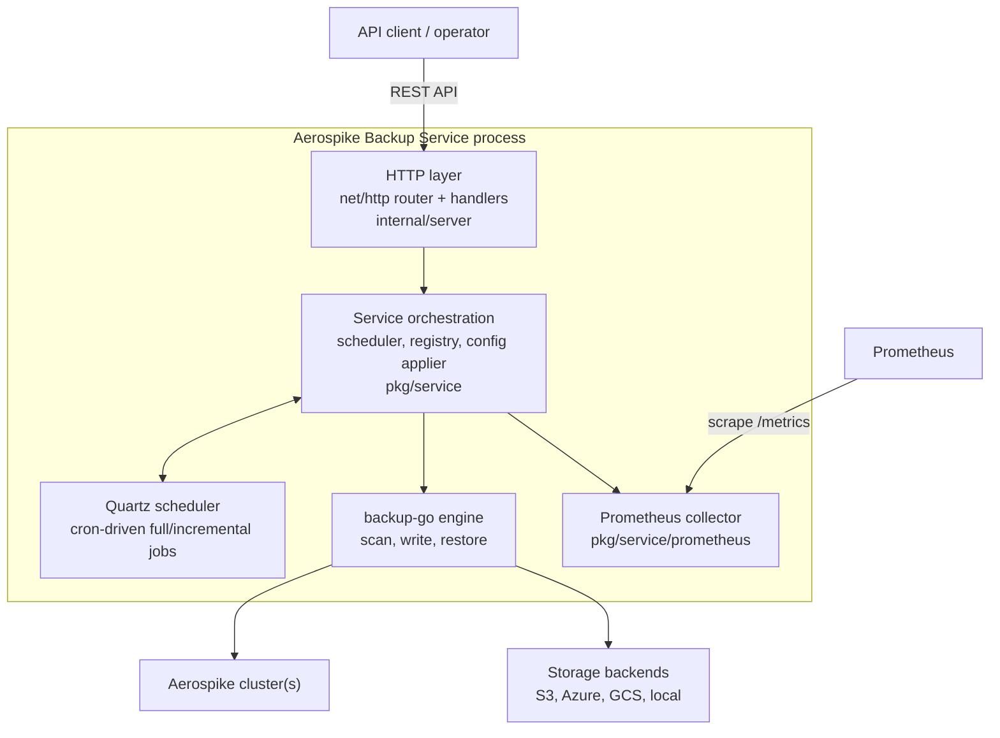

# Architecture

This document describes how Aerospike Backup Service (ABS) is put together internally: its main components, the
lifecycle of a backup/restore request, why configuration is modeled in two layers, how configuration changes get
applied without a restart, and how the service is typically deployed.

It is aimed at contributors and operators who need to understand *why* the code is structured the way it is, not just
*what* the API does — for API usage see [API examples](api-examples.md), and for configuration fields see
[Configuration](configuration.md).

## Components

- **HTTP layer** ([`internal/server`](../internal/server)) — a standard-library `net/http` router
  ([`internal/server/router.go`](../internal/server/router.go)) plus handlers
  ([`internal/server/handlers`](../internal/server/handlers)) that validate input, translate between wire DTOs and
  internal models, and delegate to the service layer. It knows nothing about storage backends or the Aerospike wire
  protocol.
- **Service orchestration** ([`pkg/service`](../pkg/service)) — the domain layer. It owns the running-backups
  registry, backup/restore orchestration, retention, history, and the `ConfigApplier` that reconciles configuration
  changes into scheduled jobs. It depends on abstractions (`aerospike.ClientManager`, `storage.Operations`,
  a backup/restore executor) rather than concrete SDKs, which is what makes it unit-testable without a live cluster.
- **Quartz scheduler** ([`reugn/go-quartz`](https://github.com/reugn/go-quartz)) — drives periodic full and
  incremental backups from each routine's cron expressions. Ad-hoc (triggered-once) backups and restores bypass
  Quartz and run immediately as background goroutines.
- **backup-go engine** ([`aerospike/backup-go`](https://github.com/aerospike/backup-go)) — the library that actually
  scans/writes Aerospike records and restores them; ABS's `backupexecutor` and `restoreexecutor` packages
  ([`pkg/service/backupexecutor`](../pkg/service/backupexecutor),
  [`pkg/service/restoreexecutor`](../pkg/service/restoreexecutor)) adapt it to ABS's job model.
- **Storage backends** ([`pkg/service/storage`](../pkg/service/storage)) — a common `Operations` interface
  implemented for S3-compatible object storage, Azure Blob Storage, Google Cloud Storage, and local disk, so the rest
  of the service is storage-agnostic.
- **Prometheus collector** ([`pkg/service/prometheus`](../pkg/service/prometheus)) — polls the running-backups
  registry and restore jobs on a fixed interval and exposes the metrics documented in [Monitoring](monitoring.md).

All of these are wired together once, at startup, in
[`internal/app/bootstrap.go`](../internal/app/bootstrap.go#L30) (`InitComponents`) — that function is the fastest way
to see the full object graph and every dependency between components.

## Request lifecycle

Backup and restore triggers are asynchronous by design: an Aerospike cluster backup or restore can run for hours, far
longer than an HTTP client should be expected to hold a connection open.

1. A client calls e.g. `POST /v1/backups/full/{name}` or `POST /v1/restore/full`.
2. The handler validates the request, looks up the routine/policy from the in-memory config, and hands off to the
   service layer (`BackupScheduler.TriggerAdHocFullBackup`, `RestoreManager.Restore`, ...), which starts the job on a
   goroutine and registers it in the running-backups registry or the restore jobs holder.
3. The handler immediately returns **`202 Accepted`** (see
   [`TriggerFullBackup`](../internal/server/handlers/backup.go#L195) and the restore handlers) — it does not wait for
   the job to finish.
4. The client polls status separately: `GET /v1/backups/currentBackup/{name}` for backups, or
   `GET /v1/restore/status/{jobId}` for restores (see [API examples](api-examples.md)). Progress is also exported as
   Prometheus metrics.
5. Triggered jobs run with a context tied to the process lifetime (derived from the top-level context created in
   [`cmd/backup/main.go`](../cmd/backup/main.go)), not the originating HTTP request's context. A job that has started
   must not be canceled just because the client that triggered it disconnected; it can only be stopped explicitly via
   `POST /v1/backups/cancel/{name}`.

Scheduled (cron-triggered) backups follow the same execution path, minus the initial HTTP request — Quartz invokes
the same orchestration code that ad-hoc triggers use.

## Why `pkg/dto` and `pkg/model` are separate

ABS keeps two parallel representations of every configuration entity (routine, policy, storage, cluster, ...):

- **`pkg/dto`** is the wire format. Its structs carry `json`/`yaml` struct tags, `validate` rules, and
  `swag`/OpenAPI annotations, and they mirror exactly what the YAML configuration file and the REST API accept and
  return. It changes whenever the public API or config file format changes, and it is what gets versioned across
  the [migration guide](../README.md#migration-guide).
- **`pkg/model`** is the internal domain representation used by the service layer and the scheduler. It has no
  serialization concerns and is free to include derived/runtime state (for example, invalidated-routine bookkeeping
  in [`pkg/model/config.go`](../pkg/model/config.go)) that should never be part of the public API surface.

Every DTO type provides `ToModel(...)` and every model type provides a matching `dto.NewXFromModel(...)` — the
conversion is explicit and one-directional at each boundary crossing, rather than tagging a single struct for both
purposes. This means:

- The YAML/JSON shape (a public compatibility surface) can be validated and evolved independently of internal
  refactors to `pkg/service`.
- Internal fields never leak into API responses or the config file by accident.
- Breaking API changes are visible as changes to `pkg/dto`, which is exactly the set of files the
  [migration guide](../README.md#migration-guide) needs to track.

## Configuration management

Configuration can be sourced from a local file path, an HTTP(S) URL, or a remote storage location (`--remote`), all
handled by [`internal/server/configuration`](../internal/server/configuration). Regardless of source, the file is
decoded into `dto.Config`, converted with `ToModel()`, and validated against the connected Aerospike cluster(s)
before the service starts (see [Configuration](configuration.md) for the file format itself).

Hot-reload — applying configuration changes without restarting the process — is handled by
[`ConfigApplier`](../pkg/service/config_applier.go):

1. The REST configuration API (`/v1/config/...`) validates a change, persists it back to the configuration source,
   and marks the affected routine(s) as invalidated on the in-memory `model.Config`.
2. `ConfigApplier.ApplyNewConfig` pops the invalidated-routine set, deletes the corresponding periodic Quartz jobs
   (full and incremental), and reschedules current ones from the updated config. This two-phase delete-then-reschedule
   sequence is required because Quartz has no atomic "replace job" API.
3. Backup history for the affected routines is resynchronized from storage in the background so that subsequent
   `GET /v1/backups/...` calls reflect the new routine configuration immediately.
4. Deleted routines are unscheduled but not rescheduled — the missing-routine case is handled explicitly rather than
   as an error path.

Ad-hoc (triggered) backups and restores are untouched by this flow; only the periodic cron schedule is reconciled.

## Deployment topologies

ABS ships as a single static binary with no required runtime dependencies beyond the Aerospike cluster(s) and the
configured storage backend, which keeps every deployment mode below built from the same artifact:

- **Binary + systemd** — the package build ([`build/package`](../build/package)) installs the binary, a config file
  under `/etc/aerospike-backup-service`, and a systemd unit
  ([`aerospike-backup-service.service`](../build/package/config/aerospike-backup-service.service)). Suited to
  running directly on a host alongside or near the Aerospike cluster. See
  [Installation](installation.md#service).
- **Docker** — a single container running the same binary; see [Installation](installation.md#docker) for a
  standalone container and the [Docker Compose guide](../build/docker-compose/README.md) for a full local stack
  (ABS + an Aerospike cluster + MinIO).
- **Kubernetes (Helm)** — the [Helm chart](../helm/aerospike-backup-service) deploys ABS as a workload with a
  mounted config, suited to environments that already run the Aerospike cluster on Kubernetes or want ABS managed
  the same way as the rest of the stack.

Configuration is what changes between topologies, not the binary: the same `--config`/`--remote` flags described in
[Configuration](configuration.md) work identically whether the file is mounted from a `ConfigMap`, baked into an
image, or read from a local path on a VM.

See [Monitoring](monitoring.md) for the `/health` and `/ready` endpoints used by systemd, Docker healthchecks, and
Kubernetes probes across all three topologies.
