<!-- Code generated by go run ./build/wiring. DO NOT EDIT. -->

# Component wiring

Constructor dependencies of `InitComponents` in `internal/app/bootstrap.go`. An arrow `A --> B` means **A is built from B**.

Regenerate with `make wiring`.

```mermaid
flowchart TB
  subgraph aerospike["aerospike"]
    aerospike_ClientFactory["aerospike.ClientFactory"]
    aerospike_ClientManager["aerospike.ClientManager"]
    aerospike_ClusterConfigSource["aerospike.ClusterConfigSource"]
    aerospike_NamespaceResolver["aerospike.NamespaceResolver"]
    aerospike_NamespaceValidator["aerospike.NamespaceValidator"]
  end
  subgraph app["app"]
    app_Components["app.Components"]
  end
  subgraph backupexecutor["backupexecutor"]
    backupexecutor_BackupExecutor["backupexecutor.BackupExecutor"]
  end
  subgraph collections["collections"]
    collections_LockMap["collections.LockMap"]
  end
  subgraph configuration["configuration"]
    configuration_Manager["configuration.Manager"]
  end
  subgraph handlers["handlers"]
    handlers_Service["handlers.Service"]
  end
  subgraph model["model"]
    model_Config["model.Config"]
  end
  subgraph prometheus["prometheus"]
    prometheus_MetricsCollector["prometheus.MetricsCollector"]
  end
  subgraph quartz["quartz"]
    quartz_Scheduler["quartz.Scheduler"]
  end
  subgraph restoreexecutor["restoreexecutor"]
    restoreexecutor_RestoreExecutor["restoreexecutor.RestoreExecutor"]
  end
  subgraph secrets["secrets"]
    secrets_PasswordResolver["secrets.PasswordResolver"]
    secrets_Resolver["secrets.Resolver"]
  end
  subgraph server["server"]
    server_ServerHTTP["server.ServerHTTP"]
  end
  subgraph service["service"]
    service_BackupCatalog["service.BackupCatalog"]
    service_BackupCompletionHandler["service.BackupCompletionHandler"]
    service_BackupOrchestrator["service.BackupOrchestrator"]
    service_BackupReporter["service.BackupReporter"]
    service_BackupRetentionManager["service.BackupRetentionManager"]
    service_BackupScheduler["service.BackupScheduler"]
    service_BackupStateRegistry["service.BackupStateRegistry"]
    service_ClusterConfigWriter["service.ClusterConfigWriter"]
    service_ConfigApplier["service.ConfigApplier"]
    service_ConfigRetriever["service.ConfigRetriever"]
    service_HistoryManager["service.HistoryManager"]
    service_NamespaceBackupRunner["service.NamespaceBackupRunner"]
    service_PathService["service.PathService"]
    service_RestoreJobsHolder["service.RestoreJobsHolder"]
    service_RestoreManager["service.RestoreManager"]
    service_RestoreValidator["service.RestoreValidator"]
    service_RoutineBackupRunner["service.RoutineBackupRunner"]
    service_StartController["service.StartController"]
    service_StartDecider["service.StartDecider"]
  end
  subgraph slog["slog"]
    slog_Handler["slog.Handler"]
    slog_Logger["slog.Logger"]
  end
  subgraph storage["storage"]
    storage_AzureStorageAccessor["storage.AzureStorageAccessor"]
    storage_GcpStorageAccessor["storage.GcpStorageAccessor"]
    storage_LocalStorageAccessor["storage.LocalStorageAccessor"]
    storage_Operations["storage.Operations"]
    storage_S3StorageAccessor["storage.S3StorageAccessor"]
  end
  aerospike_ClientFactory --> secrets_PasswordResolver
  aerospike_ClientManager --> aerospike_ClientFactory
  aerospike_ClusterConfigSource --> aerospike_ClientManager
  aerospike_NamespaceResolver --> aerospike_ClientManager
  aerospike_NamespaceValidator --> aerospike_ClientManager
  app_Components --> prometheus_MetricsCollector
  app_Components --> quartz_Scheduler
  app_Components --> server_ServerHTTP
  backupexecutor_BackupExecutor --> aerospike_ClientManager
  backupexecutor_BackupExecutor --> storage_Operations
  configuration_Manager --> aerospike_NamespaceValidator
  configuration_Manager --> storage_Operations
  handlers_Service --> aerospike_NamespaceValidator
  handlers_Service --> configuration_Manager
  handlers_Service --> model_Config
  handlers_Service --> service_BackupCatalog
  handlers_Service --> service_BackupScheduler
  handlers_Service --> service_BackupStateRegistry
  handlers_Service --> service_ConfigApplier
  handlers_Service --> service_ConfigRetriever
  handlers_Service --> service_RestoreManager
  model_Config --> aerospike_NamespaceValidator
  model_Config --> storage_Operations
  prometheus_MetricsCollector --> service_BackupStateRegistry
  prometheus_MetricsCollector --> service_RestoreJobsHolder
  quartz_Scheduler --> slog_Logger
  restoreexecutor_RestoreExecutor --> storage_Operations
  secrets_PasswordResolver --> secrets_Resolver
  server_ServerHTTP --> handlers_Service
  server_ServerHTTP --> model_Config
  service_BackupCatalog --> service_PathService
  service_BackupCatalog --> storage_Operations
  service_BackupCompletionHandler --> service_BackupRetentionManager
  service_BackupCompletionHandler --> service_BackupStateRegistry
  service_BackupCompletionHandler --> service_ClusterConfigWriter
  service_BackupOrchestrator --> service_BackupCompletionHandler
  service_BackupOrchestrator --> service_BackupReporter
  service_BackupOrchestrator --> service_BackupStateRegistry
  service_BackupOrchestrator --> service_RoutineBackupRunner
  service_BackupOrchestrator --> service_StartController
  service_BackupRetentionManager --> collections_LockMap
  service_BackupRetentionManager --> service_BackupCatalog
  service_BackupScheduler --> quartz_Scheduler
  service_BackupScheduler --> service_BackupOrchestrator
  service_BackupStateRegistry --> model_Config
  service_BackupStateRegistry --> service_HistoryManager
  service_ClusterConfigWriter --> aerospike_ClusterConfigSource
  service_ClusterConfigWriter --> service_PathService
  service_ClusterConfigWriter --> storage_Operations
  service_ConfigApplier --> model_Config
  service_ConfigApplier --> service_BackupScheduler
  service_ConfigApplier --> service_BackupStateRegistry
  service_ConfigRetriever --> service_BackupCatalog
  service_ConfigRetriever --> service_PathService
  service_ConfigRetriever --> storage_Operations
  service_HistoryManager --> service_BackupCatalog
  service_NamespaceBackupRunner --> backupexecutor_BackupExecutor
  service_NamespaceBackupRunner --> service_BackupCatalog
  service_NamespaceBackupRunner --> service_PathService
  service_PathService --> model_Config
  service_RestoreManager --> aerospike_ClientManager
  service_RestoreManager --> collections_LockMap
  service_RestoreManager --> restoreexecutor_RestoreExecutor
  service_RestoreManager --> service_BackupCatalog
  service_RestoreManager --> service_RestoreJobsHolder
  service_RestoreManager --> service_RestoreValidator
  service_RestoreValidator --> model_Config
  service_RestoreValidator --> service_StartController
  service_RoutineBackupRunner --> aerospike_NamespaceResolver
  service_RoutineBackupRunner --> service_NamespaceBackupRunner
  service_StartController --> service_BackupStateRegistry
  service_StartController --> service_StartDecider
  slog_Handler --> model_Config
  slog_Logger --> slog_Handler
  storage_AzureStorageAccessor --> secrets_Resolver
  storage_GcpStorageAccessor --> secrets_Resolver
  storage_Operations --> storage_AzureStorageAccessor
  storage_Operations --> storage_GcpStorageAccessor
  storage_Operations --> storage_LocalStorageAccessor
  storage_Operations --> storage_S3StorageAccessor
  storage_S3StorageAccessor --> secrets_Resolver
```

