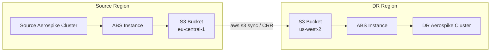

# Cross-Region Backup and Restore with Restore-by-Timestamp

This guide walks through a common disaster-recovery flow using the Aerospike Backup Service (ABS) **restore-by-timestamp** API:

1. Back up a source Aerospike cluster to S3
2. Copy backup files to an S3 bucket in another region
3. Restore into a different Aerospike cluster using `POST /v1/restore/timestamp` with **overridden `source` and `destination`**

Compared to restore-by-path (`POST /v1/restore/full`), restore-by-timestamp automatically discovers and applies the correct full + incremental backup chain for all namespaces at a given point in time.

## Architecture



## Restore-by-Timestamp Request Fields

The request body maps to [`dto.RestoreTimestampRequest`](../pkg/dto/restore_request.go).

| Field | Required | Description |
|-------|----------|-------------|
| `routine` | yes | Name of the backup routine. ABS uses this to locate `{routine}/backup/` and `{routine}/incremental/` in storage. Must match the folder name created during backup. |
| `time` | yes | Target epoch timestamp in **milliseconds** (13 digits). ABS restores to the backup state at or before this time. |
| `source` or `source-name` | optional* | Override where backup files are read from (DR bucket). |
| `destination` or `destination-name` | optional* | Override the target Aerospike cluster. |
| `policy` | optional | Restore behavior (overwrite rules, encryption, namespace remap, etc.). See [`dto.TimestampRestorePolicy`](readme/dto/dto.timestamprestorepolicy.md). |
| `secret-agent` or `secret-agent-name` | optional | For encrypted backups or secret-backed credentials. |
| `disable-reordering` | optional | Default `false`. Set `true` to disable reverse-order incremental optimization. |

\*For cross-region DR, provide **both** `source` and `destination` inline. When both are set, the routine does **not** need to exist in the DR ABS configuration — only the name string is used for path lookup.

`source`/`source-name` and `destination`/`destination-name` are mutually exclusive within each pair.

---

## Step 1 — Back Up to S3 (Source Region)

### Configure ABS

Define cluster, S3 storage, backup policy, and routine:

```yaml
aerospike-clusters:
  prod-cluster:
    seed-nodes:
      - host-name: aerospike-prod.example.com
        port: 3000
    credentials:
      user: backup-user
      password: your-password

storage:
  prod-s3:
    s3-storage:
      bucket: as-backup-prod-eu
      path: backups                    # storage root prefix inside the bucket
      s3-region: eu-central-1
      # access-key-id / secret-access-key, or use IAM role

backup-policies:
  dailyPolicy:
    parallel: 8
    retention:
      full: 10
      incremental: 5

backup-routines:
  daily-backup:
    interval-cron: "0 0 2 * * ? *"     # daily at 02:00
    incr-interval-cron: "0 0 0/2 * * ? *"
    source-cluster: prod-cluster
    storage: prod-s3
    backup-policy: dailyPolicy
    namespaces: []                     # empty = entire cluster
```

### Trigger a Backup

On demand:

```bash
curl -X POST "http://abs-source:8080/v1/backups/schedule/daily-backup"
```

Wait for completion, then list backups:

```bash
curl "http://abs-source:8080/v1/backups/full/daily-backup"
```

Example response entry:

```json
{
  "timestamp": 1704110400000,
  "namespace": "test",
  "key": "daily-backup/backup/1704110400000/data/test",
  "storage": {
    "s3-storage": {
      "bucket": "as-backup-prod-eu",
      "path": "backups",
      "s3-region": "eu-central-1"
    }
  },
  "compression": "ZSTD",
  "encryption": "NONE"
}
```

Use the `timestamp` value as the `time` field in the restore request.

### S3 Layout

Under the storage root (`backups/`), ABS writes:

```text
backups/
  daily-backup/
    backup/
      1704110400000/
        metadata.yaml
        data/
          test/              ← backup files for namespace "test"
        configuration/       ← optional cluster config backup
    incremental/
      1704117600000/
        data/
          test/
```

---

## Step 2 — Copy Backups to Another S3 Region

ABS does not copy between buckets; use AWS tooling. **Preserve the directory structure** under the storage root prefix so the `routine` path remains valid.

### Option A: `aws s3 sync` (one-time or scheduled)

```bash
aws s3 sync \
  s3://as-backup-prod-eu/backups/daily-backup/ \
  s3://as-backup-dr-us-west/backups/daily-backup/ \
  --source-region eu-central-1 \
  --region us-west-2
```

### Option B: S3 Cross-Region Replication (CRR)

Set up CRR from `as-backup-prod-eu` → `as-backup-dr-us-west` for the `backups/` prefix.

### Copy Rules

- Copy the **entire routine folder** (`daily-backup/`), including both `backup/` and `incremental/` trees and `metadata.yaml` files.
- Keep the same relative paths if you use the same `s3-storage.path` (`backups`) in the DR restore request.
- If you change the root prefix in DR (e.g. `path: dr-backups`), adjust paths accordingly.

---

## Step 3 — Restore-by-Timestamp with Overrides

Run this on an **ABS instance in the DR region** (or any host that can reach both the DR S3 bucket and the DR Aerospike cluster).

### API

```http
POST /v1/restore/timestamp
```

### Cross-Region Example (inline overrides)

```bash
curl -X POST "http://abs-dr:8080/v1/restore/timestamp" \
  -H "Content-Type: application/json" \
  -d '{
    "routine": "daily-backup",
    "time": 1704110400000,

    "source": {
      "s3-storage": {
        "bucket": "as-backup-dr-us-west",
        "path": "backups",
        "s3-region": "us-west-2"
      }
    },

    "destination": {
      "seed-nodes": [
        { "host-name": "aerospike-dr.example.com", "port": 3000 }
      ],
      "credentials": {
        "user": "admin",
        "password": "dr-password"
      }
    },

    "policy": {
      "no-generation": true
    }
  }'
```

Response: `202 Accepted` with a job ID.

### Using Preconfigured Entities on DR ABS

If the DR ABS configuration already defines storage and cluster entities:

```json
{
  "routine": "daily-backup",
  "time": 1704110400000,
  "source-name": "dr-s3",
  "destination-name": "dr-cluster",
  "policy": {
    "no-generation": true
  }
}
```

In this case the routine **must** exist in the local ABS configuration (or provide both overrides inline).

### Encrypted Backups with Secret Agent

```json
{
  "routine": "daily-backup",
  "time": 1704110400000,
  "source": {
    "s3-storage": {
      "bucket": "as-backup-dr-us-west",
      "path": "backups",
      "s3-region": "us-west-2"
    }
  },
  "secret-agent-name": "my-decryption-agent",
  "destination": {
    "seed-nodes": [
      { "host-name": "aerospike-dr.example.com", "port": 3000 }
    ],
    "credentials": {
      "user": "admin",
      "password": "secret:my-db-password",
      "secret-agent": {
        "address": "127.0.0.1",
        "port": 3005
      }
    }
  },
  "policy": {
    "no-generation": true,
    "encryption": {
      "mode": "AES256",
      "key-env": "BACKUP_ENCRYPTION_KEY"
    }
  }
}
```

---

## What ABS Does Internally

For the given `routine`, `time`, and `source`:

1. Finds the latest full backup per namespace completed before `time`
2. Finds incremental backups from that full backup up to `time`
3. Restores all namespaces in parallel
4. On an **empty** destination namespace, may apply incrementals in reverse order (`CREATE_ONLY`) for efficiency — disable with `"disable-reordering": true`

```
Timeline ──────────────────────────────────────────────▶

Backups:  [Full A]─[Incr A1]─[Full B]─[Incr B1]─[Incr B2]─▶ T ─[Incr B3]─...
                                                          ↑
                                                    restore time

Restored: Full B + Incr B1 + Incr B2  (Incr B3 excluded — after T)
```

---

## Monitor the Restore Job

```bash
# Job status
curl "http://abs-dr:8080/v1/restore/status/<jobId>"

# All restore jobs
curl "http://abs-dr:8080/v1/restore/jobs"

# Cancel a running restore
curl -X POST "http://abs-dr:8080/v1/restore/cancel/<jobId>"
```

---

## Policy Options

| Scenario | Policy |
|----------|--------|
| DR into empty cluster | `"no-generation": true` (or defaults) |
| Overwrite existing data | `"no-generation": true`, optionally `"replace": true` |
| Only insert new records | `"unique": true` |
| Namespace remap | `"namespace": { "source": "prod", "destination": "prod_dr" }` |
| Encrypted backup | `"encryption": { "mode": "AES256", "key-env": "BACKUP_ENCRYPTION_KEY" }` |

---

## Checklist

| # | Check |
|---|-------|
| 1 | `routine` matches the folder name in S3 (`daily-backup/...`) |
| 2 | `time` is in **milliseconds**, not seconds |
| 3 | DR bucket contains both `backup/` and `incremental/` trees |
| 4 | `source.s3-storage.path` matches the prefix used when copying (`backups`) |
| 5 | `destination` points at the DR Aerospike cluster |
| 6 | Encryption / secret-agent configured if backups were encrypted |

---

## See Also

- [Restore-by-Timestamp tutorial](restore-by-timestamp-tutorial.md) — general API usage and override patterns
- [`dto.RestoreTimestampRequest`](readme/dto/dto.restoretimestamprequest.md) — field reference
- [`dto.S3Storage`](readme/dto/dto.s3storage.md) — S3 storage configuration
- [OpenAPI: restore timestamp](https://aerospike.github.io/aerospike-backup-service/#/Restore/restoreTimestamp)
