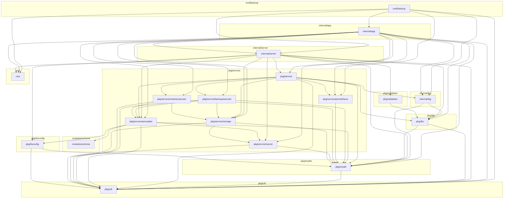

<!-- Code generated by go run ./build/pkggraph. DO NOT EDIT. -->

# Package dependencies

First-party Go import graph of Aerospike Backup Service. An arrow `A --> B` means **A imports B** (compile-time dependency).

Generated from `go/packages` with packages and edges sorted, so the output is deterministic. Test files, `docs/`, `build/`, and `test/` are omitted. External modules are omitted.

Regenerate with `make pkggraph`.

## Coarse modules

Sibling packages under `pkg/util`, `pkg/dto`, and `internal/server` are collapsed.

## Go packages

```mermaid
flowchart TB
  subgraph sg_cmd_backup["cmd/backup"]
    cmd_backup["cmd/backup"]
  end
  subgraph sg_internal_app["internal/app"]
    internal_app["internal/app"]
  end
  subgraph sg_internal_log["internal/log"]
    internal_log["internal/log"]
  end
  subgraph sg_internal_server["internal/server"]
    internal_server["internal/server"]
    internal_server_configuration["internal/server/configuration"]
    internal_server_handlers["internal/server/handlers"]
    internal_server_middleware["internal/server/middleware"]
    internal_server_reload["internal/server/reload"]
    internal_server_tlsconfig["internal/server/tlsconfig"]
  end
  subgraph sg_modules_schema["modules/schema"]
    modules_schema["modules/schema"]
  end
  subgraph sg_pkg_dto["pkg/dto"]
    pkg_dto["pkg/dto"]
    pkg_dto_decoder["pkg/dto/decoder"]
  end
  subgraph sg_pkg_model["pkg/model"]
    pkg_model["pkg/model"]
  end
  subgraph sg_pkg_service["pkg/service"]
    pkg_service["pkg/service"]
    pkg_service_aerospike["pkg/service/aerospike"]
    pkg_service_backupexecutor["pkg/service/backupexecutor"]
    pkg_service_prometheus["pkg/service/prometheus"]
    pkg_service_restoreexecutor["pkg/service/restoreexecutor"]
    pkg_service_secret["pkg/service/secret"]
    pkg_service_storage["pkg/service/storage"]
  end
  subgraph sg_pkg_tlsconfig["pkg/tlsconfig"]
    pkg_tlsconfig["pkg/tlsconfig"]
  end
  subgraph sg_pkg_util["pkg/util"]
    pkg_util_attr["pkg/util/attr"]
    pkg_util_collections["pkg/util/collections"]
    pkg_util_optional["pkg/util/optional"]
    pkg_util_ptr["pkg/util/ptr"]
    pkg_util_safepath["pkg/util/safepath"]
    pkg_util_syncutil["pkg/util/syncutil"]
    pkg_util_timeutil["pkg/util/timeutil"]
    pkg_util_try["pkg/util/try"]
  end
  subgraph sg_pkg_validation["pkg/validation"]
    pkg_validation["pkg/validation"]
  end
  subgraph sg_root["root"]
    root["root"]
  end
  cmd_backup --> internal_app
  cmd_backup --> internal_log
  cmd_backup --> internal_server
  cmd_backup --> pkg_service_prometheus
  cmd_backup --> pkg_util_attr
  cmd_backup --> root
  internal_app --> internal_log
  internal_app --> internal_server
  internal_app --> internal_server_configuration
  internal_app --> internal_server_handlers
  internal_app --> internal_server_tlsconfig
  internal_app --> pkg_dto
  internal_app --> pkg_dto_decoder
  internal_app --> pkg_model
  internal_app --> pkg_service
  internal_app --> pkg_service_aerospike
  internal_app --> pkg_service_backupexecutor
  internal_app --> pkg_service_prometheus
  internal_app --> pkg_service_restoreexecutor
  internal_app --> pkg_service_secret
  internal_app --> pkg_service_storage
  internal_app --> pkg_util_collections
  internal_app --> root
  internal_log --> pkg_dto_decoder
  internal_log --> pkg_model
  internal_server --> internal_server_handlers
  internal_server --> internal_server_middleware
  internal_server --> pkg_model
  internal_server --> pkg_util_attr
  internal_server_configuration --> internal_server_tlsconfig
  internal_server_configuration --> pkg_dto
  internal_server_configuration --> pkg_dto_decoder
  internal_server_configuration --> pkg_model
  internal_server_configuration --> pkg_service_aerospike
  internal_server_configuration --> pkg_service_storage
  internal_server_configuration --> root
  internal_server_handlers --> internal_server_configuration
  internal_server_handlers --> internal_server_tlsconfig
  internal_server_handlers --> pkg_dto
  internal_server_handlers --> pkg_dto_decoder
  internal_server_handlers --> pkg_model
  internal_server_handlers --> pkg_service
  internal_server_handlers --> pkg_service_aerospike
  internal_server_handlers --> pkg_validation
  internal_server_handlers --> root
  internal_server_middleware --> pkg_model
  internal_server_reload --> pkg_util_attr
  internal_server_tlsconfig --> internal_server_reload
  internal_server_tlsconfig --> pkg_model
  internal_server_tlsconfig --> pkg_service_secret
  internal_server_tlsconfig --> pkg_tlsconfig
  internal_server_tlsconfig --> pkg_util_safepath
  pkg_dto --> pkg_dto_decoder
  pkg_dto --> pkg_model
  pkg_dto --> pkg_util_collections
  pkg_dto --> pkg_util_optional
  pkg_dto --> pkg_util_ptr
  pkg_dto --> pkg_util_safepath
  pkg_dto_decoder --> pkg_util_attr
  pkg_model --> pkg_util_optional
  pkg_model --> pkg_util_ptr
  pkg_service --> internal_log
  pkg_service --> pkg_dto_decoder
  pkg_service --> pkg_model
  pkg_service --> pkg_service_aerospike
  pkg_service --> pkg_service_backupexecutor
  pkg_service --> pkg_service_prometheus
  pkg_service --> pkg_service_restoreexecutor
  pkg_service --> pkg_service_storage
  pkg_service --> pkg_util_attr
  pkg_service --> pkg_util_collections
  pkg_service --> pkg_util_ptr
  pkg_service --> pkg_util_syncutil
  pkg_service --> pkg_util_timeutil
  pkg_service --> pkg_util_try
  pkg_service_aerospike --> modules_schema
  pkg_service_aerospike --> pkg_model
  pkg_service_aerospike --> pkg_service_secret
  pkg_service_aerospike --> pkg_tlsconfig
  pkg_service_aerospike --> pkg_util_attr
  pkg_service_aerospike --> pkg_util_collections
  pkg_service_aerospike --> pkg_util_ptr
  pkg_service_aerospike --> pkg_util_syncutil
  pkg_service_aerospike --> pkg_util_try
  pkg_service_backupexecutor --> pkg_model
  pkg_service_backupexecutor --> pkg_service_aerospike
  pkg_service_backupexecutor --> pkg_service_storage
  pkg_service_backupexecutor --> pkg_util_ptr
  pkg_service_backupexecutor --> pkg_util_syncutil
  pkg_service_prometheus --> pkg_model
  pkg_service_restoreexecutor --> pkg_model
  pkg_service_restoreexecutor --> pkg_service_aerospike
  pkg_service_restoreexecutor --> pkg_service_storage
  pkg_service_restoreexecutor --> pkg_util_ptr
  pkg_service_secret --> pkg_model
  pkg_service_secret --> pkg_util_safepath
  pkg_service_storage --> pkg_model
  pkg_service_storage --> pkg_service_secret
  pkg_service_storage --> pkg_util_attr
  pkg_service_storage --> pkg_util_collections
  pkg_service_storage --> pkg_util_ptr
  pkg_tlsconfig --> pkg_model
  pkg_tlsconfig --> pkg_util_attr
  pkg_tlsconfig --> pkg_util_safepath
  pkg_util_timeutil --> pkg_util_attr
  pkg_util_try --> pkg_util_attr
  pkg_validation --> pkg_dto
```

